# Go 开发工具生态全景图

```mermaid
flowchart 
    subgraph Dev[编写代码]
        A1[goimports<br>代码格式化+import管理]
        A2[gci<br>import分组排序]
        A3[gomodifytags<br>批量修改struct标签]
        A4[stringer<br>枚举String生成]
        A5[cobra-cli<br>CLI应用骨架]
        A6[swag<br>Swagger文档生成]
    end

    subgraph QA[检查质量]
        B1[govet<br>官方静态分析]
        B2[staticcheck<br>高级静态检查]
        B3[golangci-lint<br>集成多种linter]
        B4[revive<br>高性能代码风格检查]
        B5[govulncheck<br>安全漏洞扫描]
        B6[errcheck<br>错误处理检查]
    end

    subgraph Test[测试与Mock]
        C1[gotests<br>生成测试模板]
        C2[mockgen<br>接口Mock生成]
        C3[testify<br>断言&mock支持]
        C4[ginkgo+gomega<br>BDD测试]
        C5[dockertest<br>Docker集成测试]
    end

    subgraph Build[构建与发布]
        D1[goreleaser<br>打包发布]
        D2[goup<br>Go版本管理]
        D3[modgv<br>依赖关系可视化]
        D4[migrate<br>数据库迁移]
        D5[sqlc/ent<br>数据库代码生成]
    end

    subgraph Ops[性能与运维]
        E1[dlv<br>调试器]
        E2[pprof<br>性能分析]
        E3[benchstat<br>基准测试对比]
        E4[go-torch<br>火焰图分析]
        E5[hey<br>HTTP压测]
        E6[air<br>热重载]
        E7[reflex<br>自动执行命令]
        E8[gore<br>Go REPL]
    end

    Dev --> QA --> Test --> Build --> Ops
```

# Go 开发工具一览表（附星级评分）

| 环节 | 副标签 | 工具 | 分类 | 功能简介 | 常用命令示例 | 社区推荐度 |
|------|------|------|------|----------|---------------|------------|
| 编写代码 | 格式化、import | `goimports` | 代码格式化 / Import 管理 | 格式化代码并自动添加/删除 `import` | `goimports -w .` | ⭐⭐⭐⭐⭐ |
| 编写代码 | import、排序 | `gci` | Import 排序 | 分组并排序 `import`，支持自定义规则 | `gci write .` | ⭐⭐⭐⭐ |
| 编写代码 | struct、tag | `gomodifytags` | Struct Tag 管理 | 批量修改 struct 标签 | `gomodifytags -file model.go -struct User -add-tags json` | ⭐⭐⭐⭐⭐ |
| 编写代码 | 枚举、代码生成 | `stringer` | 枚举代码生成 | 为枚举类型生成 `String()` 方法 | `go generate ./...` | ⭐⭐⭐⭐⭐ |
| 编写代码 | 脚手架、CLI | `cobra-cli` | CLI 脚手架 | 快速生成 Cobra CLI 应用结构 | `cobra-cli init` | ⭐⭐⭐⭐⭐ |
| 编写代码 | 文档、Swagger | `swag` | API 文档生成 | 基于代码注释生成 Swagger 文档 | `swag init` | ⭐⭐⭐⭐ |
| 检查质量 | 静态检查 | `staticcheck` | 静态分析 / 代码检查 | 检测 bug、性能问题及不规范写法 | `staticcheck ./...` | ⭐⭐⭐⭐⭐ |
| 检查质量 | Lint 合集 | `golangci-lint` | 综合 Linter 工具 | 一次运行多种 linters，代码质量检查 | `golangci-lint run` | ⭐⭐⭐⭐⭐ |
| 检查质量 | 风格、lint | `revive` | 代码风格检查 | 高性能替代 `golint`、可定制规则 | — | ⭐⭐⭐⭐ |
| 检查质量 | 官方、静态分析 | `govet` | 静态分析（官方） | 官方提供的基础静态分析工具 | `go vet ./...` | ⭐⭐⭐⭐⭐ |
| 检查质量 | error、遗漏 | `errcheck` | 错误处理检查 | 检查是否遗漏了 `error` 处理 | — | ⭐⭐⭐⭐ |
| 检查质量 | 安全、漏洞 | `govulncheck` | 安全漏洞扫描 | 检查依赖库是否有已知漏洞 | — | ⭐⭐⭐⭐ |
| 检查质量 | 复杂度 | `gocyclo` | 复杂度分析 | 计算函数圈复杂度 | — | ⭐⭐⭐ |
| 测试与Mock | 测试生成 | `gotests` | 测试生成器 | 自动生成测试用例模板 | `gotests -w -all .` | ⭐⭐⭐⭐ |
| 测试与Mock | Mock | `mockgen` | Mock 生成 | 根据接口生成 mock 实现 | `mockgen -source=...` | ⭐⭐⭐⭐ |
| 测试与Mock | 测试输出、报告 | `gotestsum` | 测试输出美化 | 优雅展示测试结果 | — | ⭐⭐⭐⭐ |
| 构建与发布 | 发布、打包 | `goreleaser` | 构建发布 | 一键打包、生成版本发布 | — | ⭐⭐⭐⭐⭐ |
| 构建与发布 | 版本管理 | `goup` | Go 版本管理 | 管理多个 Go 版本切换 | — | ⭐⭐⭐⭐ |
| 构建与发布 | 依赖、可视化 | `modgv` | 依赖可视化 | 可视化 `go.mod` 依赖关系图 | — | ⭐⭐⭐ |
| 构建与发布 | SQL、代码生成 | `sqlc` | SQL 生成器 | 从 SQL 生成类型安全 Go 代码 | — | ⭐⭐⭐⭐ |
| 构建与发布 | ORM、代码生成 | `ent` | ORM 框架 | 通过 Schema 生成 ORM 访问层 | — | ⭐⭐⭐⭐ |
| 构建与发布 | 数据库、迁移 | `migrate` | DB 迁移工具 | 管理数据库迁移版本 | — | ⭐⭐⭐⭐ |
| 性能与运维 | 调试 | `dlv` | 调试器 | 支持断点、单步调试、变量查看 | `dlv debug main.go` | ⭐⭐⭐⭐⭐ |
| 性能与运维 | 基准对比 | `benchstat` | 性能对比分析 | 对比基准测试结果，分析性能 | `benchstat old.txt new.txt` | ⭐⭐⭐⭐ |
| 性能与运维 | 分析、性能 | `pprof` | 性能分析 | CPU、内存、Goroutine 分析 | — | ⭐⭐⭐⭐⭐ |
| 性能与运维 | 火焰图 | `go-torch` | 火焰图生成 | 将 pprof 数据生成火焰图 | — | ⭐⭐⭐⭐ |
| 性能与运维 | 压测 | `hey` | 压测工具 | 进行 HTTP 请求压力测试 | — | ⭐⭐⭐⭐ |
| 性能与运维 | 热重载 | `air` | 热重载 | 代码变更自动重载，提升开发效率 | — | ⭐⭐⭐⭐ |
| 性能与运维 | 自动化、监听 | `reflex` | 任务自动触发 | 文件变化自动执行命令 | — | ⭐⭐⭐⭐ |
| 性能与运维 | REPL | `gore` | REPL | Go 语言交互式环境 | — | ⭐⭐⭐ |
