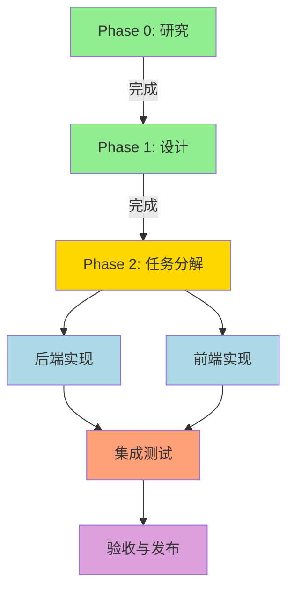

# Implementation Plan: 学习进度与测验体验优化

**Branch**: `016-progress-quiz-ux` | **Date**: 2025-12-30 | **Spec**: [spec.md](./spec.md)
**Input**: Feature specification from `/specs/016-progress-quiz-ux/spec.md`

**Note**: This template is filled in by the `/speckit.plan` command. See `.specify/templates/commands/plan.md` for the execution workflow.

## Summary

本功能旨在修复学习进度追踪和测验系统中的关键问题,提升用户体验。主要包括五个方面:

1. **准确章节数量统计**: 修复主题列表页面显示的章节数量不准确问题,确保前端直接从静态数据源(static-routes.ts)获取准确的章节总数
2. **三状态章节追踪**: 实现完整的章节学习状态(未开始/学习中/已完成),通过数据库learning_progress表的status字段实现状态持久化
3. **可用的测验功能**: 修复测验加载失败和提交错误,确保Quiz Session机制正常工作,测验题目正确加载并可提交
4. **一致的进度数据**: 统一所有页面的进度数据来源,通过前端Context和SWR缓存保证数据一致性
5. **优化测验导航**: 新增测验中心页面,提供统一的测验记录入口,优化用户访问路径

技术方案遵循现有架构:后端使用Go + GoFrame v2 (gf/v2),前端使用Next.js + React Context + SWR,数据库为SQLite。优先通过业务逻辑优化和前端状态管理改进,最小化数据库schema变更。

## Technical Context

**Language/Version**: Go 1.24 (backend), TypeScript 5.x / Node.js (frontend)  
**Primary Dependencies**: 
- Backend: GoFrame v2 (gf/v2 包含 gdb ORM), SQLite driver
- Frontend: Next.js 14, React 18, SWR, Ant Design 5, TypeScript
**Storage**: SQLite with GoFrame v2 gdb ORM (tables: learning_progress, quiz_sessions, quiz_attempts)  
**Testing**: Go testing (backend), Jest + React Testing Library (frontend)  
**Target Platform**: Web application (desktop + mobile responsive)  
**Project Type**: Web (monorepo with backend/ and frontend/ directories)  
**Performance Goals**: 
- 主题/章节列表页面加载时间 ≤ 2秒
- 测验提交响应时间 ≤ 1秒
- 前端状态更新延迟 ≤ 500ms
**Constraints**: 
- 不破坏现有API向后兼容性
- 测试覆盖率 ≥ 80%
- 避免大规模数据库迁移,优先业务逻辑实现
- 支持主流浏览器最新两个版本
**Scale/Scope**: 
- 4个主题(lexical_elements, constants, variables, types)
- 约50+章节
- 预计每个主题5-15个测验题目
- 单用户同时学习章节数 ≤ 10

## Constitution Check

*GATE: Must pass before Phase 0 research. Re-check after Phase 1 design.*

- **Principle I (代码质量与可维护性):** ✅ 方案清晰,采用分层架构,职责单一。前端使用Hooks封装逻辑,后端按领域拆分service/repository层。
- **Principle II (显式错误处理):** ✅ 所有API调用包含错误处理,前端使用try-catch和错误边界,后端返回明确错误码和消息。无静默失败。
- **Principle III/XXI/XXXVI (全面测试):** ✅ 规划单元测试覆盖率≥80%。后端测试progress/quiz service及repository,前端测试核心Hooks和组件。
- **Principle IV (单一职责):** ✅ 前端按功能拆分Hooks(useProgress/useQuiz),后端按领域分包(progress/quiz)。每个文件职责明确。
- **Principle V/XV (一致文档与中文要求):** ✅ 后端代码注释全部使用中文,API文档详细。前端组件使用JSDoc注释。
- **Principle VI (YAGNI):** ✅ 不引入复杂模式,优先利用现有infrastructure(SWR缓存/GoFrame ORM),避免过度设计。
- **Principle VII (安全优先):** ✅ 所有API需JWT认证,输入校验(topic/chapter枚举检查),使用参数化查询防SQL注入。
- **Principle VIII/XVIII (可预测结构):** ✅ 遵循现有目录结构,backend/internal按DDD分层,frontend/按Next.js App Router规范。
- **Principle IX (依赖纪律):** ✅ 无新增外部依赖,仅使用现有技术栈(GoFrame/Next.js/Ant Design/SWR)。
- **Principle X (性能优化):** ✅ 前端使用SWR缓存减少重复请求,后端添加数据库索引(user_id, topic)优化查询。
- **Principle XI (文档同步):** ✅ 完成后更新根README的功能清单和路线图状态。
- **Principle XIV (清晰分层注释):** ✅ 所有新增代码包含中文注释说明用途和逻辑。
- **Principle XVI (浅层逻辑):** ✅ 避免深层嵌套,使用卫语句提前返回,复杂逻辑拆分为独立函数。
- **Principle XVII (一致开发者体验):** ✅ 保持现有开发模式,新增代码风格与现有一致,便于团队理解和维护。
- **Principle XIX (包级 README):** ✅ 如新增包(如quiz center组件),添加README说明用途和API。
- **Principle XX (代码质量执行):** ✅ 后端执行go fmt/go vet/golint,前端执行ESLint和Prettier格式化。
- **Principle XXII (分层菜单导航):** ✅ 测验中心作为独立路由,导航结构清晰,提供返回和错误提示。
- **Principle XXIII (双学习模式):** ✅ 本功能主要优化HTTP模式,CLI模式保持现有逻辑不变。
- **Principle XXIV (层次化章节结构):** ✅ 章节数据从quiz_data目录加载,结构已规范化,无需调整。
- **Principle XXV (HTTP/CLI 一致性):** ✅ HTTP API返回结构规范,错误处理统一,使用标准HTTP状态码。

## Project Structure

### Documentation (this feature)

```text
specs/016-progress-quiz-ux/
├── plan.md              # This file (/speckit.plan command output)
├── research.md          # Phase 0 output (技术调研与决策)
├── data-model.md        # Phase 1 output (数据模型设计)
├── quickstart.md        # Phase 1 output (快速开始指南)
├── contracts/           # Phase 1 output (API契约定义)
│   ├── progress-api.md  # 进度追踪API规范
│   └── quiz-api.md      # 测验API规范
└── tasks.md             # Phase 2 output (/speckit.tasks command - NOT created by /speckit.plan)
```

### Source Code (repository root)

```text
backend/
├── internal/
│   ├── domain/
│   │   ├── progress/
│   │   │   ├── progress.go           # [MODIFY] 添加状态计算逻辑
│   │   │   ├── service.go            # [MODIFY] 优化进度统计方法
│   │   │   └── repository.go         # [MODIFY] 添加按主题统计查询
│   │   └── quiz/
│   │       ├── quiz.go               # [MODIFY] 修复测验加载逻辑
│   │       ├── service.go            # [MODIFY] 完善提交验证
│   │       └── repository.go         # [MODIFY] 优化session查询
│   ├── interfaces/
│   │   ├── progress_handler.go       # [MODIFY] 添加章节计数API
│   │   └── quiz_handler.go           # [MODIFY] 修复错误处理
│   └── infra/
│       └── repository/
│           ├── progress_repo.go      # [MODIFY] 实现新的查询方法
│           └── quiz_repo.go          # [MODIFY] 优化session管理
└── tests/
    ├── interfaces/
    │   ├── progress_handler_test.go  # [MODIFY] 添加章节计数测试
    │   └── quiz_handler_test.go      # [MODIFY] 添加测验流程测试
    └── repository/
        ├── progress_repo_test.go     # [MODIFY] 测试新增查询
        └── quiz_repo_test.go         # [MODIFY] 测试session逻辑

frontend/
├── app/(protected)/
│   ├── topics/
│   │   ├── page.tsx                  # [MODIFY] 修复章节计数显示
│   │   └── [topic]/
│   │       ├── page.tsx              # [MODIFY] 添加三状态显示
│   │       └── [chapter]/
│   │           └── page.tsx          # [MODIFY] 优化测验入口
│   ├── progress/
│   │   └── page.tsx                  # [MODIFY] 统一数据源
│   └── quiz-center/                  # [NEW] 测验中心
│       └── page.tsx                  # [NEW] 测验记录列表
├── components/
│   ├── learning/
│   │   ├── TopicCard.tsx             # [MODIFY] 显示准确章节数
│   │   ├── ChapterList.tsx           # [MODIFY] 三状态标识
│   │   └── ChapterStatusBadge.tsx    # [NEW] 状态徽章组件
│   └── quiz/
│       ├── QuizCenter.tsx            # [NEW] 测验中心容器
│       └── QuizHistoryCard.tsx       # [NEW] 历史记录卡片
├── hooks/
│   ├── useProgress.ts                # [MODIFY] 统一进度数据管理
│   ├── useQuiz.ts                    # [MODIFY] 修复提交逻辑
│   └── useChapterStatus.ts           # [NEW] 章节状态计算Hook
├── services/
│   ├── progressService.ts            # [MODIFY] 添加章节统计API
│   └── quizService.ts                # [MODIFY] 完善错误处理
├── lib/
│   └── static-routes.ts              # [EXISTING] 章节数据源(已有)
└── tests/
    ├── hooks/
    │   ├── useProgress.test.ts       # [NEW] 进度Hook测试
    │   └── useQuiz.test.ts           # [NEW] 测验Hook测试
    └── components/
        ├── ChapterList.test.tsx      # [NEW] 章节列表测试
        └── QuizCenter.test.tsx       # [NEW] 测验中心测试
```

**Structure Decision**: 本功能采用现有Web应用双目录结构(backend/ + frontend/),遵循项目已有的DDD分层(backend)和Next.js App Router(frontend)模式。主要通过修改现有文件优化逻辑,新增少量组件实现测验中心功能。无需调整数据库schema,通过业务逻辑实现状态计算。

## Complexity Tracking

> **本功能无Constitution违规项,无需复杂度豁免**

本功能严格遵循所有Constitution原则:
- 复用现有数据库表结构,仅添加一个字段(submitted_at)用于防重复提交
- 利用现有技术栈(GoFrame/Next.js/SWR),无新增外部依赖
- 采用简单直接的解决方案,避免过度设计(如不引入Redux/Zustand)
- 遵循YAGNI原则,聚焦核心问题修复

所有技术决策均在"研究文档"(research.md)中详细说明了选择理由和替代方案对比。

---

## Phase 0-2: 实施概要

### Phase 0: 研究与调研 ✅ 完成

**输出文档**: [research.md](./research.md)

**调研内容**:
1. ✅ 章节数量统计方案 → 决策: 前端static-routes.ts作为单一数据源
2. ✅ 章节学习状态计算逻辑 → 决策: 复用learning_progress.status字段
3. ✅ 测验加载与提交流程修复 → 决策: 规范Session创建+防重复提交机制
4. ✅ 前端状态管理一致性方案 → 决策: 规范SWR缓存key+统一刷新策略
5. ✅ 测验中心导航设计 → 决策: 新增独立/quiz-center路由

所有NEEDS CLARIFICATION项已解决,技术方案明确。

---

### Phase 1: 设计与契约 ✅ 完成

**输出文档**:
- [data-model.md](./data-model.md): 数据库表结构、领域实体、API DTO定义
- [contracts/progress-api.md](./contracts/progress-api.md): 进度追踪API规范(5个端点)
- [contracts/quiz-api.md](./contracts/quiz-api.md): 测验功能API规范(5个端点)
- [quickstart.md](./quickstart.md): 快速开始指南和验收标准

**关键设计决策**:
1. **数据库迁移**: 仅添加`quiz_sessions.submitted_at`字段,向后兼容
2. **API设计**: 遵循RESTful规范,统一错误码体系
3. **状态转换**: 明确定义not_started → in_progress → completed流程
4. **前端类型**: TypeScript类型定义完整,确保类型安全

**Agent Context更新**: ✅ 已更新GitHub Copilot instructions

---

### Phase 2: 任务分解 (下一步)

**将通过 `/speckit.tasks` 命令生成**: `tasks.md`

**预计任务结构**:

#### 后端任务 (Backend)
- T001: 创建数据库迁移脚本 `016_add_submitted_at.sql`
- T002-T005: 修改`internal/domain/progress/`层(service/repository)
- T006-T010: 修改`internal/domain/quiz/`层(session管理/题目加载/提交逻辑)
- T011-T015: 更新`internal/interfaces/`层(handler修改/新增端点)
- T016-T020: 编写单元测试(覆盖率≥80%)

#### 前端任务 (Frontend)
- T021-T025: 修改进度相关组件(TopicCard/ChapterList/状态徽章)
- T026-T030: 优化测验相关Hooks(useQuiz/useProgress)
- T031-T035: 新增测验中心(page/QuizCenter组件/历史卡片)
- T036-T040: 更新services层(progressService/quizService)
- T041-T045: 编写组件测试(覆盖率≥80%)

#### 集成与验收 (Integration)
- T046-T050: 端到端测试(5个用户场景)
- T051: 性能测试(加载时间/响应时间验证)
- T052: 文档更新(根README/API文档)

**估算**: 15-20个任务,3-5天完成

---

## 实施路线图



**当前状态**: Phase 1完成 ✅  
**下一步**: 运行 `/speckit.tasks` 生成详细任务清单

---

## 关键成果物清单

### 已完成 ✅
- [x] Feature Spec (spec.md) - 用户故事、需求、验收标准
- [x] 技术调研 (research.md) - 5个关键决策点的调研结果
- [x] 数据模型 (data-model.md) - 表结构、实体、DTO定义
- [x] API契约 (contracts/*.md) - 10个API端点的完整规范
- [x] 快速开始 (quickstart.md) - 开发指南和验收标准
- [x] Agent Context更新 - GitHub Copilot instructions同步

### 待完成 ⏳
- [ ] 任务清单 (tasks.md) - 通过`/speckit.tasks`生成
- [ ] 后端实现 - 按tasks.md执行
- [ ] 前端实现 - 按tasks.md执行
- [ ] 测试用例 - 覆盖率≥80%
- [ ] 集成测试 - 5个端到端场景
- [ ] 文档更新 - README/CHANGELOG

---

## 验收门槛

### 功能完整性 (P1 - 必需)
- [ ] SC-001: 章节数量准确率100% (实际=显示)
- [ ] SC-002: 100%章节有明确状态标识
- [ ] SC-003: 测验加载成功率≥95%
- [ ] SC-004: 跨页面进度数据一致性100%
- [ ] SC-005: 主页到测验中心≤2次点击
- [ ] SC-007: 测验提交成功率≥98%

### 性能指标 (P1 - 必需)
- [ ] 主题列表页面加载≤2秒
- [ ] 测验提交响应≤1秒
- [ ] 前端状态更新延迟≤500ms

### 质量保证 (P1 - 必需)
- [ ] 后端单元测试覆盖率≥80%
- [ ] 前端核心组件测试覆盖率≥80%
- [ ] 端到端测试覆盖所有P1用户故事

### 用户体验 (P2 - 优选)
- [ ] SC-006: 90%情况下5秒内看到更新进度
- [ ] SC-008: 100%题目可查看正确答案
- [ ] SC-009: 无测验章节提示清晰度100%
- [ ] SC-010: 新用户章节"未开始"准确率100%

---

## 风险与缓解

### 技术风险
1. **数据迁移复杂度** (Low)
   - 风险: 添加submitted_at字段可能影响性能
   - 缓解: 已设计为可选字段,向后兼容,分批更新现有记录

2. **SWR缓存不一致** (Medium)
   - 风险: 多个页面缓存key不统一导致数据不同步
   - 缓解: 规范progressKeys定义,统一刷新策略,编写测试验证

### 业务风险
1. **用户期望管理** (Low)
   - 风险: 修复基础问题后用户期望更多高级功能
   - 缓解: 发布说明明确本次范围,收集反馈纳入后续规划

2. **测验数据迁移** (Low)
   - 风险: quiz_data目录结构变化导致加载失败
   - 缓解: 实施数据格式校验,提供清晰错误提示

---

## 参考资料

### 内部文档
- [Constitution](./../.specify/memory/constitution.md)
- [Spec Template](./../.specify/templates/spec-template.md)
- [Plan Template](./../.specify/templates/plan-template.md)

### 技术文档
- GoFrame v2: https://goframe.org/
- Next.js 14: https://nextjs.org/docs
- SWR: https://swr.vercel.app/
- Ant Design 5: https://ant.design/

### 相关Feature
- Feature 011: Learning Progress & Quiz (基础实现)
- Feature 014: Quiz UX Enhancement (测验体验优化)
- Feature 015: Dashboard Homepage (主页设计)

---

## 总结

本实施计划为Feature 016"学习进度与测验体验优化"提供完整的技术蓝图:

✅ **Phase 0完成**: 5个关键技术决策点已调研并明确方案  
✅ **Phase 1完成**: 数据模型、API契约、快速开始指南已就绪  
⏳ **Phase 2待执行**: 通过`/speckit.tasks`生成详细任务清单后开始实施

**关键亮点**:
- 🎯 遵循YAGNI原则,最小化变更(仅1个新增字段)
- 🔄 复用现有基础设施(GoFrame/SWR/Ant Design)
- 📐 明确的三状态模型(not_started/in_progress/completed)
- 🛡️ 双重防重复提交机制(前端useRef+后端submitted_at)
- 📊 统一的进度数据管理(SWR缓存key规范)

**预计交付**: 3-5天完成所有实施,测试覆盖率≥80%,用户体验显著提升。
