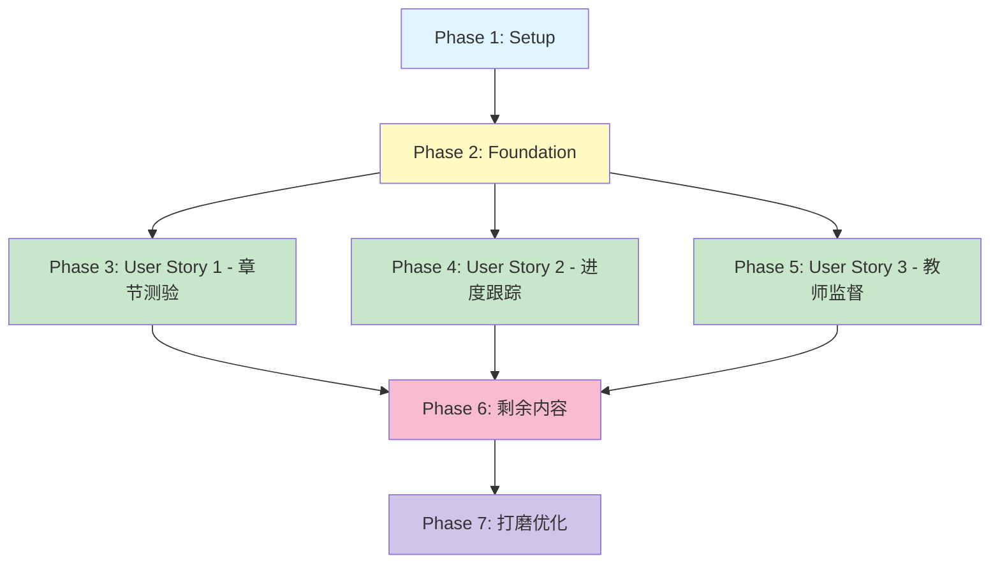

# Tasks: 补全题库内容实现完整的学习测验系统

**Input**: Design documents from `/specs/017-complete-quiz-bank/`  
**Prerequisites**: plan.md ✅, spec.md ✅, research.md ✅, data-model.md ✅, contracts/ ✅, quickstart.md ✅

**Tests**: Per the constitution, features MUST have at least 80% unit test coverage. Test tasks are included below.

**Organization**: Tasks are grouped by user story to enable independent implementation and testing of each story.

## Format: `[ID] [P?] [Story] Description`

- **[P]**: Can run in parallel (different files, no dependencies)
- **[Story]**: Which user story this task belongs to (e.g., US1, US2, US3)
- Include exact file paths in descriptions

## Path Conventions

This is a web application with backend (Go) and frontend (TypeScript/React):
- **Backend**: `backend/` (Go code, YAML quiz data)
- **Frontend**: `frontend/` (Next.js/React components)
- **Scripts**: `backend/scripts/` (utility tools)
- **Tests**: `backend/tests/`, `frontend/__tests__/`

## Constitution Guardrails

- 所有注释与用户文档必须产出中文内容,且保持清晰一致(Principle V/XV)。
- 需规划达到≥80%测试覆盖,各包包含 *_test.go 与示例,前端核心组件同样达标(Principle III/XXI/XXXVI)。
- 目录/文件/函数保持单一职责与可预测结构,遵循标准 Go 布局(仅根目录 main, go.mod/go.sum 完整)并补齐包 README(Principle IV/VIII/XVIII/XIX)。
- 外部依赖与复杂度最小化,错误处理显式,避免 YAGNI(Principle II/VI/IX)。
- 完成后需包含更新 README 等文档的任务(Principle XI)。

---

## Phase 1: Setup (Shared Infrastructure)

**Purpose**: Project initialization and tool chain setup

- [X] T001 Create directory structure for quiz data storage in backend/quiz_data/{lexical_elements,constants,variables,types}
- [X] T002 [P] Create quiz data index file backend/quiz_data/index.yaml for fast chapter lookup
- [X] T003 [P] Create scripts directory backend/scripts/ with README.md documenting all utility tools

**Checkpoint**: Basic structure ready for tool development

---

## Phase 2: Foundational (Blocking Prerequisites)

**Purpose**: Core infrastructure that MUST be complete before ANY user story can be implemented

**⚠️ CRITICAL**: No user story work can begin until this phase is complete

### Tool Chain Development (BLOCKING)

- [X] T004 Implement template generator backend/scripts/generate_quiz_template.go to create YAML skeleton with metadata and question placeholders
- [X] T005 [P] Implement format validator backend/scripts/validate_quiz_yaml.go with 100% automated checks (ID format, type enum, difficulty enum, option count, answer format)
- [X] T006 [P] Implement quality checker backend/scripts/quiz_quality_check.go with 80%+ automated content validation (explanation length, Go spec reference, code executability, duplicate detection)
- [X] T007 [P] Implement progress tracker backend/scripts/check_quiz_progress.ps1 to show completion status across all 41 chapters

### Backend Service Extension (BLOCKING)

- [X] T008 Extend QuizService interface in backend/internal/domain/quiz/service.go with GetAllChapters(), RecordQuizAttempt(), GetUserHistory() methods
- [X] T009 Implement QuizRepository in backend/internal/infra/repository/quiz_repository.go with YAML loading, sync.Map caching, and index-based lookup
- [X] T010 [P] Implement AttemptRepository in backend/internal/infra/repository/attempt_repository.go for JSON-based quiz attempt persistence
- [X] T011 [P] Add HTTP routes in backend/internal/interfaces/http/quiz_handler.go for GET /api/v1/quiz/chapters, GET /api/v1/quiz/:topic/:chapter, POST /api/v1/quiz/:topic/:chapter
- [X] T012 [P] Add HTTP routes in backend/internal/interfaces/http/progress_handler.go for GET /api/v1/quiz/history/:topic/:chapter, GET /api/v1/quiz/progress

### Test Infrastructure (BLOCKING)

- [X] T013 Create test utilities in backend/tests/testutil/quiz_fixtures.go for generating mock quiz data
- [X] T014 [P] Unit test QuizService in backend/tests/unit/quiz_service_test.go covering random selection, scoring, validation edge cases
- [X] T015 [P] Unit test QuizRepository in backend/tests/unit/quiz_repository_test.go covering YAML loading, caching, index lookup performance
- [X] T016 [P] Integration test quiz API in backend/tests/integration/quiz_api_test.go covering all 5 endpoints with various scenarios
- [X] T017 [P] Benchmark test quiz loading in backend/tests/benchmark/quiz_load_test.go targeting <100ms first load, <10ms cached

**Checkpoint**: Foundation ready - user story implementation can now begin in parallel

---

## Phase 3: User Story 1 - 学习者完成章节测验 (Priority: P1) 🎯 MVP

**Goal**: Enable learners to take quizzes for any chapter, get instant scoring and detailed explanations

**Independent Test**: Access any chapter quiz page (e.g., /quiz/lexical_elements/keywords), answer questions, submit, and view results with explanations

### Quiz Content Creation for User Story 1

**Strategy**: Complete high-frequency chapters first to deliver MVP value quickly

#### lexical_elements (9 chapters) - CORE PRIORITY

- [ ] T018 [P] [US1] Create quiz YAML backend/quiz_data/lexical_elements/keywords.yaml (40 questions: 16 single_choice, 12 multiple_choice, 8 code_output, 4 code_fix, difficulty: easy 60%, medium 30%, hard 10%)
- [ ] T019 [P] [US1] Create quiz YAML backend/quiz_data/lexical_elements/identifiers.yaml (35 questions following same distribution pattern)
- [ ] T020 [P] [US1] Create quiz YAML backend/quiz_data/lexical_elements/tokens.yaml (30 questions)
- [ ] T021 [P] [US1] Create quiz YAML backend/quiz_data/lexical_elements/integers.yaml (40 questions)
- [ ] T022 [P] [US1] Create quiz YAML backend/quiz_data/lexical_elements/floats.yaml (38 questions)
- [ ] T023 [P] [US1] Create quiz YAML backend/quiz_data/lexical_elements/strings.yaml (45 questions)
- [ ] T024 [P] [US1] Create quiz YAML backend/quiz_data/lexical_elements/semicolons.yaml (30 questions)
- [ ] T025 [P] [US1] Create quiz YAML backend/quiz_data/lexical_elements/imaginary.yaml (32 questions)
- [ ] T026 [P] [US1] Create quiz YAML backend/quiz_data/lexical_elements/runes.yaml (35 questions)

#### types (10 core chapters) - HIGH PRIORITY

- [ ] T027 [P] [US1] Create quiz YAML backend/quiz_data/types/slice.yaml (45 questions)
- [ ] T028 [P] [US1] Create quiz YAML backend/quiz_data/types/map.yaml (42 questions)
- [ ] T029 [P] [US1] Create quiz YAML backend/quiz_data/types/interface.yaml (48 questions)
- [ ] T030 [P] [US1] Create quiz YAML backend/quiz_data/types/struct.yaml (45 questions)
- [ ] T031 [P] [US1] Create quiz YAML backend/quiz_data/types/pointer.yaml (38 questions)
- [ ] T032 [P] [US1] Create quiz YAML backend/quiz_data/types/channel.yaml (42 questions)
- [ ] T033 [P] [US1] Create quiz YAML backend/quiz_data/types/function.yaml (40 questions)
- [ ] T034 [P] [US1] Create quiz YAML backend/quiz_data/types/array.yaml (35 questions)
- [ ] T035 [P] [US1] Create quiz YAML backend/quiz_data/types/string.yaml (38 questions)
- [ ] T036 [P] [US1] Create quiz YAML backend/quiz_data/types/numeric.yaml (40 questions)

### Quality Validation for User Story 1

- [ ] T037 [US1] Run format validation on all lexical_elements chapters: `go run backend/scripts/validate_quiz_yaml.go backend/quiz_data/lexical_elements/` - must achieve 100% pass rate
- [ ] T038 [US1] Run format validation on all types core chapters: `go run backend/scripts/validate_quiz_yaml.go backend/quiz_data/types/` - must achieve 100% pass rate
- [ ] T039 [US1] Run quality check on all lexical_elements chapters: `go run backend/scripts/quiz_quality_check.go backend/quiz_data/lexical_elements/` - must achieve ≥80% quality score
- [ ] T040 [US1] Run quality check on all types core chapters: `go run backend/scripts/quiz_quality_check.go backend/quiz_data/types/` - must achieve ≥80% quality score
- [ ] T041 [US1] Perform manual spot-check (20% random sampling) on lexical_elements chapters for semantic accuracy and Go spec alignment
- [ ] T042 [US1] Perform manual spot-check (20% random sampling) on types core chapters for semantic accuracy and Go spec alignment

### Frontend Implementation for User Story 1

- [ ] T043 [P] [US1] Create QuizList component in frontend/components/quiz/QuizList.tsx to display all available chapters with completion status
- [ ] T044 [P] [US1] Create QuizQuestion component in frontend/components/quiz/QuizQuestion.tsx to render question stem, options (radio/checkbox), and handle user selection
- [ ] T045 [P] [US1] Create QuizResult component in frontend/components/quiz/QuizResult.tsx to show score, correct/incorrect markers, and detailed explanations
- [ ] T046 [P] [US1] Create AnswerExplanation component in frontend/components/quiz/AnswerExplanation.tsx to render formatted markdown explanations with code highlighting
- [ ] T047 [US1] Create quiz page frontend/app/(protected)/quiz/[topic]/[chapter]/page.tsx integrating all components with API calls to backend
- [ ] T048 [US1] Add API client functions in frontend/services/quizService.ts for getChapters(), startQuiz(), submitQuiz()

### Frontend Tests for User Story 1

- [ ] T049 [P] [US1] Unit test QuizQuestion component in frontend/__tests__/components/quiz/QuizQuestion.test.tsx covering single_choice, multiple_choice, code_output, code_fix types
- [ ] T050 [P] [US1] Unit test QuizResult component in frontend/__tests__/components/quiz/QuizResult.test.tsx covering score calculation display and explanation rendering
- [ ] T051 [P] [US1] Integration test quiz flow in frontend/__tests__/integration/quiz-flow.test.tsx simulating full user journey from chapter select to result view
- [ ] T052 [P] [US1] E2E test quiz experience using Cypress in frontend/tests/e2e/quiz.cy.ts covering happy path and edge cases (empty quiz bank, unanswered questions)

### Independent Test Criteria for User Story 1

**Verify independently**:
1. Navigate to /quiz/lexical_elements/keywords → See random 6-10 questions
2. Answer all questions → Submit → See score and explanations
3. Click "重新测验" → Get different question combination (≥70% different)
4. Repeat for at least 3 different chapters → All show working quizzes
5. Try an empty chapter → See friendly "暂无测验题目,敬请期待" message

**Success Metrics**:
- ✅ 19 chapters completed (9 lexical_elements + 10 types core)
- ✅ ~700-900 questions total (≈45% of target 1200-2000)
- ✅ 100% format validation pass rate
- ✅ ≥80% quality validation pass rate
- ✅ All quiz UI components working with <200ms p95 response time

---

## Phase 4: User Story 2 - 学习进度跟踪与历史记录 (Priority: P2)

**Goal**: Enable learners to view their learning progress, best scores, and historical quiz attempts

**Independent Test**: Complete multiple quizzes for different chapters, then visit /progress to see aggregated statistics and drill into chapter-specific history

### Progress Tracking Implementation

- [ ] T053 [P] [US2] Implement ProgressService in backend/internal/domain/progress/service.go with CalculateProgress(), GetBestScore(), GetAttemptCount() methods
- [ ] T054 [P] [US2] Implement ProgressRepository in backend/internal/infra/repository/progress_repository.go aggregating data from AttemptRepository
- [ ] T055 [US2] Add caching layer in ProgressService using sync.Map to cache user progress (TTL: 5 minutes, invalidate on new attempt)

### Frontend Progress UI

- [ ] T056 [P] [US2] Create ProgressChart component in frontend/components/progress/ProgressChart.tsx using Chart.js to visualize completion percentage by topic
- [ ] T057 [P] [US2] Create ChapterProgressCard component in frontend/components/progress/ChapterProgressCard.tsx showing status badge (未学/学习中/已完成), best score, attempt count
- [ ] T058 [P] [US2] Create HistoryList component in frontend/components/progress/HistoryList.tsx showing time-sorted quiz attempts with score and detail link
- [ ] T059 [US2] Create progress page frontend/app/(protected)/progress/page.tsx aggregating all progress components with API integration
- [ ] T060 [US2] Create chapter history page frontend/app/(protected)/progress/[topic]/[chapter]/page.tsx showing detailed attempt history

### Frontend Tests for User Story 2

- [ ] T061 [P] [US2] Unit test ProgressChart component in frontend/__tests__/components/progress/ProgressChart.test.tsx with mock progress data
- [ ] T062 [P] [US2] Unit test ChapterProgressCard component in frontend/__tests__/components/progress/ChapterProgressCard.test.tsx covering all status states
- [ ] T063 [P] [US2] Integration test progress page in frontend/__tests__/integration/progress.test.tsx verifying correct data aggregation and navigation

### Backend Tests for User Story 2

- [ ] T064 [P] [US2] Unit test ProgressService in backend/tests/unit/progress_service_test.go covering edge cases (zero attempts, multiple attempts same chapter)
- [ ] T065 [P] [US2] Integration test progress API in backend/tests/integration/progress_api_test.go verifying GET /api/v1/quiz/progress and GET /api/v1/quiz/history/:topic/:chapter

### Independent Test Criteria for User Story 2

**Verify independently**:
1. Complete quizzes for 3 different chapters with varying scores
2. Visit /progress → See accurate completion stats (3/41 chapters completed)
3. Verify best score shown for each chapter matches highest attempt
4. Click on a chapter → See chronological list of all attempts
5. Click on attempt detail → See original questions, user answers, correct answers

**Success Metrics**:
- ✅ Progress calculation accurate across all completed chapters
- ✅ History records persist across sessions (JSON storage)
- ✅ Cache hit rate >90% for progress queries
- ✅ Page load time <500ms for progress overview

---

## Phase 5: User Story 3 - 教师监督学习效果 (Priority: P3)

**Goal**: Provide teachers/admins with aggregated analytics to identify weak knowledge areas and student performance patterns

**Independent Test**: Create multiple test accounts, complete various quizzes, then log in as admin to view student performance dashboard

### Admin Dashboard Backend

- [ ] T066 [P] [US3] Implement AnalyticsService in backend/internal/domain/analytics/service.go with GetStudentProgress(), GetQuestionStats(), IdentifyWeakAreas() methods
- [ ] T067 [P] [US3] Implement AnalyticsRepository in backend/internal/infra/repository/analytics_repository.go aggregating multi-user quiz attempts
- [ ] T068 [US3] Add admin authentication middleware in backend/internal/interfaces/http/middleware/admin_auth.go verifying teacher role
- [ ] T069 [US3] Add admin routes in backend/internal/interfaces/http/admin_handler.go for GET /api/v1/admin/students, GET /api/v1/admin/stats/:topic/:chapter

### Frontend Admin UI

- [ ] T070 [P] [US3] Create StudentProgressTable component in frontend/components/admin/StudentProgressTable.tsx showing all students with completion rate and average score
- [ ] T071 [P] [US3] Create QuestionStatsChart component in frontend/components/admin/QuestionStatsChart.tsx visualizing question-level error rates
- [ ] T072 [P] [US3] Create WeakAreaHighlight component in frontend/components/admin/WeakAreaHighlight.tsx identifying chapters/questions with >50% error rate
- [ ] T073 [US3] Create admin dashboard page frontend/app/(protected)/admin/page.tsx integrating all analytics components
- [ ] T074 [US3] Create student detail page frontend/app/(protected)/admin/students/[userId]/page.tsx showing individual learning patterns

### Tests for User Story 3

- [ ] T075 [P] [US3] Unit test AnalyticsService in backend/tests/unit/analytics_service_test.go covering multi-user aggregation edge cases
- [ ] T076 [P] [US3] Integration test admin API in backend/tests/integration/admin_api_test.go with authentication and authorization checks
- [ ] T077 [P] [US3] Unit test StudentProgressTable component in frontend/__tests__/components/admin/StudentProgressTable.test.tsx with mock student data

### Independent Test Criteria for User Story 3

**Verify independently**:
1. Create 5 test student accounts, complete varying quizzes (different chapters, scores)
2. Log in as admin → Navigate to /admin
3. See table of all students with accurate completion percentages
4. Click on a chapter → See question-level stats (e.g., "Question keywords-015: 60% error rate")
5. Identify weak areas marked in red (>50% error rate)

**Success Metrics**:
- ✅ Analytics aggregate data from all users accurately
- ✅ Admin dashboard loads in <1 second even with 100+ students
- ✅ Weak area identification highlights actionable insights
- ✅ Role-based access control prevents non-admins from accessing /admin

---

## Phase 6: Remaining Quiz Content (Fill Gaps)

**Purpose**: Complete remaining 22 chapters to reach full 41-chapter coverage and 1200-2000 question target

### constants (6 chapters)

- [ ] T078 [P] Create quiz YAML backend/quiz_data/constants/boolean.yaml (30 questions)
- [ ] T079 [P] Create quiz YAML backend/quiz_data/constants/rune.yaml (32 questions)
- [ ] T080 [P] Create quiz YAML backend/quiz_data/constants/integer.yaml (35 questions)
- [ ] T081 [P] Create quiz YAML backend/quiz_data/constants/floating_point.yaml (33 questions)
- [ ] T082 [P] Create quiz YAML backend/quiz_data/constants/complex.yaml (30 questions)
- [ ] T083 [P] Create quiz YAML backend/quiz_data/constants/string.yaml (35 questions)

### variables (5 chapters)

- [ ] T084 [P] Create quiz YAML backend/quiz_data/variables/variable_declarations.yaml (38 questions)
- [ ] T085 [P] Create quiz YAML backend/quiz_data/variables/short_declarations.yaml (35 questions)
- [ ] T086 [P] Create quiz YAML backend/quiz_data/variables/blank_identifier.yaml (30 questions)
- [ ] T087 [P] Create quiz YAML backend/quiz_data/variables/type_conversions.yaml (40 questions)
- [ ] T088 [P] Create quiz YAML backend/quiz_data/variables/zero_value.yaml (32 questions)

### types (remaining 11 chapters)

- [ ] T089 [P] Create quiz YAML backend/quiz_data/types/boolean.yaml (30 questions)
- [ ] T090 [P] Create quiz YAML backend/quiz_data/types/type_definitions.yaml (38 questions)
- [ ] T091 [P] Create quiz YAML backend/quiz_data/types/type_aliases.yaml (35 questions)
- [ ] T092 [P] Create quiz YAML backend/quiz_data/types/type_parameters.yaml (42 questions)
- [ ] T093 [P] Create quiz YAML backend/quiz_data/types/type_constraints.yaml (40 questions)
- [ ] T094 [P] Create quiz YAML backend/quiz_data/types/type_inference.yaml (35 questions)
- [ ] T095 [P] Create quiz YAML backend/quiz_data/types/type_unification.yaml (33 questions)
- [ ] T096 [P] Create quiz YAML backend/quiz_data/types/underlying_types.yaml (32 questions)
- [ ] T097 [P] Create quiz YAML backend/quiz_data/types/type_identity.yaml (35 questions)
- [ ] T098 [P] Create quiz YAML backend/quiz_data/types/method_sets.yaml (38 questions)
- [ ] T099 [P] Create quiz YAML backend/quiz_data/types/type_assertions.yaml (40 questions)

### Validation for Remaining Content

- [ ] T100 Run format validation on constants chapters: `go run backend/scripts/validate_quiz_yaml.go backend/quiz_data/constants/` - must achieve 100% pass
- [ ] T101 Run format validation on variables chapters: `go run backend/scripts/validate_quiz_yaml.go backend/quiz_data/variables/` - must achieve 100% pass
- [ ] T102 Run format validation on remaining types chapters: `go run backend/scripts/validate_quiz_yaml.go backend/quiz_data/types/` - must achieve 100% pass
- [ ] T103 Run quality check on all chapters: `go run backend/scripts/quiz_quality_check.go backend/quiz_data/` - overall quality score ≥80%
- [ ] T104 Manual spot-check 20% of constants/variables/types remaining chapters for Go 1.24 spec alignment

---

## Phase 7: Polish & Cross-Cutting Concerns

**Purpose**: Final refinements, performance optimization, and comprehensive documentation

### Performance Optimization

- [ ] T105 [P] Optimize YAML loading with lazy loading for non-essential chapters (load on first access rather than startup)
- [ ] T106 [P] Add response compression (gzip) for API endpoints to reduce bandwidth
- [ ] T107 [P] Implement frontend code splitting per topic (separate bundles for lexical_elements, constants, variables, types)
- [ ] T108 Run performance benchmark: verify <100ms quiz load, <50ms quiz generation, 1000 concurrent users supported

### Accessibility & UX

- [ ] T109 [P] Add keyboard navigation support for quiz questions (arrow keys to navigate, Enter to submit)
- [ ] T110 [P] Add screen reader ARIA labels to all quiz components
- [ ] T111 [P] Implement mobile-responsive design for quiz pages (test on iOS Safari, Android Chrome)
- [ ] T112 [P] Add loading states and error boundaries for all async operations

### Documentation

- [ ] T113 [P] Update backend/README.md with quiz system architecture, API documentation, and chapter coverage table
- [ ] T114 [P] Update frontend/README.md with component usage examples and testing instructions
- [ ] T115 [P] Update specs/017-complete-quiz-bank/README.md with feature completion summary and quality metrics
- [ ] T116 [P] Create backend/scripts/README.md documenting all utility tools (usage, examples, troubleshooting)
- [ ] T117 Update root README.md with quiz feature announcement and quick start guide

### Final Quality Checks

- [ ] T118 Run full test suite: `go test ./... -cover` - verify ≥80% coverage for backend
- [ ] T119 Run frontend test suite: `npm test -- --coverage` - verify ≥80% coverage for quiz components
- [ ] T120 Run CI quality checks: go fmt, go vet, golint, ESLint - must pass with zero violations
- [ ] T121 Generate progress report: `./backend/scripts/check_quiz_progress.sh` - verify 41/41 chapters complete, 1200-2000 questions total
- [ ] T122 Manual smoke test: Complete quizzes for 5 random chapters, verify all features work end-to-end

---

## Dependency Graph (User Story Completion Order)

**Critical Path**: Setup → Foundation → User Story 1 (highest impact, must be complete first)

**Parallel Opportunities**:
- Within Foundation: T005, T006, T007 (tool chain), T010, T011, T012 (backend), T014, T015, T016, T017 (tests) can run in parallel
- Within User Story 1: All quiz content creation tasks (T018-T036) can run in parallel (19 chapters)
- User Story 2 and 3 can start after Foundation (not dependent on User Story 1 completion)
- Within Phase 6: All remaining content tasks (T078-T099) can run in parallel (22 chapters)

---

## Implementation Strategy

### MVP-First Approach

**MVP = User Story 1 完成 19 个核心章节**:
- Delivers immediate value: learners can take quizzes for most important chapters
- Covers ~700-900 questions (45% of target range)
- Enables full quiz flow testing: select chapter → answer questions → view results
- Can be deployed independently without User Story 2/3

**Incremental Delivery**:
1. **Sprint 1 (Week 1-2)**: Phase 1 + Phase 2 → Foundation ready
2. **Sprint 2 (Week 3-4)**: Phase 3 (User Story 1) → MVP deployed with 19 chapters
3. **Sprint 3 (Week 5-6)**: Phase 4 (User Story 2) + Phase 6 (Remaining Content) → Full 41 chapters + Progress tracking
4. **Sprint 4 (Optional, Week 7-8)**: Phase 5 (User Story 3) + Phase 7 (Polish) → Admin analytics + Production-ready

### Parallel Execution Examples

**Example 1: Foundation Phase Parallelization** (Week 1-2)

Team of 3 developers can parallelize:
- Developer A: T004, T005, T006, T007 (tool chain - 4 tasks)
- Developer B: T008, T009, T010, T011, T012 (backend services - 5 tasks)
- Developer C: T013, T014, T015, T016, T017 (tests - 5 tasks)

All complete in parallel, then T037-T042 (validation) runs sequentially.

**Example 2: User Story 1 Content Creation Parallelization** (Week 3-4)

Team of 5 content creators can divide:
- Creator 1: lexical_elements chapters (T018-T026 = 9 tasks)
- Creator 2-3: types core chapters (T027-T036 = 10 tasks, split 5-5)
- Creator 4: Frontend components (T043-T048 = 6 tasks)
- Creator 5: Frontend tests (T049-T052 = 4 tasks)

Content creation and UI development run in parallel, then validation (T037-T042) runs after content complete.

**Example 3: Phase 6 Content Completion Parallelization** (Week 5-6)

Team of 3-4 content creators can divide:
- Creator 1: constants chapters (T078-T083 = 6 tasks)
- Creator 2: variables chapters (T084-T088 = 5 tasks)
- Creator 3-4: types remaining chapters (T089-T099 = 11 tasks, split 6-5)

All 22 chapters can be created in parallel in 1-2 weeks.

---

## Task Summary

### Total Tasks: 122

**By Phase**:
- Phase 1 (Setup): 3 tasks
- Phase 2 (Foundation): 14 tasks (BLOCKING)
- Phase 3 (User Story 1 - MVP): 35 tasks
- Phase 4 (User Story 2): 13 tasks
- Phase 5 (User Story 3): 12 tasks
- Phase 6 (Remaining Content): 27 tasks
- Phase 7 (Polish): 18 tasks

**By Type**:
- Quiz Content Creation: 41 tasks (1 per chapter)
- Backend Development: 20 tasks
- Frontend Development: 18 tasks
- Testing: 23 tasks
- Validation/QA: 12 tasks
- Documentation: 5 tasks
- Infrastructure: 3 tasks

**Parallelizable Tasks**: 78 tasks (64%) marked with [P]

**Estimated Timeline**:
- **With 1 developer**: 20-24 weeks (sequential execution)
- **With 3-5 developers**: 6-8 weeks (parallelized as shown above)
- **MVP only (Phase 1-3)**: 4 weeks with 3 developers

---

## Quality Gates

Each phase has quality gates that must pass before proceeding:

### Phase 2 (Foundation) Exit Criteria:
- ✅ All 4 utility tools (generate, validate, quality_check, progress) working with --help documentation
- ✅ All 5 backend API endpoints returning valid responses (tested with curl)
- ✅ All unit tests passing with ≥80% coverage
- ✅ Integration tests passing for quiz API

### Phase 3 (User Story 1) Exit Criteria:
- ✅ 19 chapters (9 lexical_elements + 10 types core) completed
- ✅ 100% format validation pass rate (`validate_quiz_yaml.go`)
- ✅ ≥80% quality score (`quiz_quality_check.go`)
- ✅ Manual spot-check (20%) confirms Go 1.24 spec alignment
- ✅ All quiz UI components passing unit tests
- ✅ E2E test covering full quiz flow passing
- ✅ Performance: <200ms p95 response time for quiz APIs

### Phase 4 (User Story 2) Exit Criteria:
- ✅ Progress calculation accurate for all completed chapters
- ✅ History records persist and load correctly
- ✅ Cache hit rate >90% for progress queries
- ✅ All progress UI components passing tests

### Phase 5 (User Story 3) Exit Criteria:
- ✅ Admin analytics accurately aggregate multi-user data
- ✅ Role-based access control enforced (non-admins blocked)
- ✅ Weak area identification working correctly

### Phase 6 (Remaining Content) Exit Criteria:
- ✅ All 41 chapters completed
- ✅ Total questions: 1200-2000
- ✅ 100% format validation pass rate across all chapters
- ✅ ≥80% overall quality score
- ✅ Progress report shows 100% completion

### Phase 7 (Polish) Exit Criteria:
- ✅ Performance benchmarks met (<100ms load, 1000 concurrent users)
- ✅ Accessibility audit passed (WCAG 2.1 AA)
- ✅ Mobile responsiveness verified on iOS/Android
- ✅ All documentation updated and accurate
- ✅ Full test suite passing with ≥80% coverage
- ✅ CI pipeline green (fmt, vet, lint, tests)

---

## Risk Mitigation

### Risk: Quiz content creation takes longer than expected

**Mitigation**:
- Prioritize high-frequency chapters (lexical_elements, types core) for MVP
- Use template generator to reduce manual YAML writing
- Automate 80%+ of quality validation to reduce review time
- Allow flexible question count (30-50 per chapter) instead of rigid targets
- Consider staged rollout: deploy with 20 chapters, add remaining 21 in v1.1

### Risk: Quality validation reveals systematic content issues

**Mitigation**:
- Run validation early and often (after every 5 chapters)
- Use existing comments.yaml (35 questions) as quality baseline reference
- Document common content mistakes in quickstart.md FAQ
- Implement automated checks for most common errors (e.g., missing Go spec reference)

### Risk: Backend performance doesn't meet targets with 2000 questions

**Mitigation**:
- Implement lazy loading (load chapters on first access)
- Use sync.Map caching for frequently accessed chapters
- Add index.yaml for O(1) chapter lookup instead of directory scanning
- Monitor benchmark tests (T017, T108) continuously
- If needed, implement Redis caching (but prefer avoiding per YAGNI principle)

### Risk: Team capacity insufficient for 6-week timeline

**Mitigation**:
- Focus on MVP (User Story 1) for initial release - only 19 chapters needed
- Defer User Story 3 (admin analytics) to v1.1 if needed - it's P3 priority
- Leverage parallelization: content creation is highly parallelizable (41 independent tasks)
- Consider hybrid approach: core team creates 20 chapters, community contributions for remaining 21

---

## Next Steps

1. **Review this task list** with the team and adjust estimates
2. **Assign owners** to each phase based on expertise:
   - Backend developer(s): Foundation, User Story 2/3 backend
   - Frontend developer(s): User Story 1/2/3 UI
   - Content creator(s): Quiz YAML creation (T018-T099)
   - QA engineer: Test tasks (T013-T017, T049-T052, T061-T065, T075-T077, T118-T122)
3. **Set up project tracking**: Create issues/tickets for each task in project management tool
4. **Kick off Sprint 1**: Start with Phase 1 (Setup) and Phase 2 (Foundation) immediately
5. **Schedule checkpoints**: Weekly demos showing progress on each user story
6. **Monitor quality gates**: Ensure each phase passes exit criteria before moving to next

**Ready to implement?** Start with T001-T003 (Setup) to create the directory structure! 🚀
